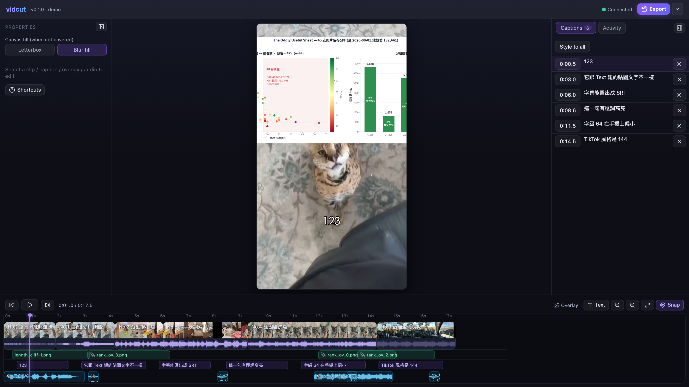

<div align="center">

# vidcut

**The AI-native video editor — your AI cuts through MCP, you supervise in the browser.**

[](LICENSE)
[](tsconfig.base.json)
[](#connect-your-ai)

[繁體中文](README.zh-TW.md)



</div>

## What is vidcut?

vidcut is a **local-first timeline editor for vertical short video (1080×1920)** built around one idea: the AI and the human edit **the same timeline, at the same time**.

It is _not_ a prompt-to-video generator. An AI agent (Claude Code, or any MCP client) edits the project through [31 MCP tools](#mcp-tools) — importing footage, cutting, captioning, mixing audio, rendering. Every change appears **live in your browser** over WebSocket. You drag a caption, trim a clip, leave a review note — and the AI reads your adjustments back and keeps working. A human-in-the-loop editing loop, not a black box.

- 🖥️ **Local & private** — a single Node process on `127.0.0.1:3845`. Your footage never leaves your machine.
- 🤝 **Built for supervision** — the AI can call `request_review`; you annotate in the browser; it reads your feedback and continues.
- 🔍 **WYSIWYG captions & overlays** — preview and export render from the _same_ rasterized text card (byte-identical PNGs), guarded by a pixel-level regression suite.
- 🎬 **Real render pipeline** — ffmpeg composes the final 1080×1920 video from `project.json`, with progress reporting.

## How it works

```
┌──────────────┐   MCP  /mcp    ┌───────────────────────────┐   WebSocket  /ws   ┌───────────────┐
│ Claude Code  │ ─────────────▶ │   vidcut server  :3845    │ ◀────────────────▶ │  Browser UI   │
│ (or any MCP  │                │  ProjectStore · commands  │                    │  timeline ·   │
│  client)     │ ◀───────────── │  ffmpeg · whisper · cards │                    │  A/B preview ·│
└──────────────┘  review loop   └────────────┬──────────────┘                    │  inspector    │
                                             │                                   └───────────────┘
                                        project.json
                                     (single source of truth)
```

One process, one port, four kinds of traffic: static UI, `/media` (native Range for `<video>`), `/mcp`, and `/ws`. Every state change — from the AI or from you — goes through the same serialized command path and is broadcast to the browser as immer patches.

## Features

- ✂️ **Timeline editing** — split / delete-left / delete-right / freeze-frame at the playhead, trim by dragging, reorder, magnetic track, cursor-anchored zoom, snapping with guide lines, undo/redo
- 📺 **Seamless preview** — A/B dual-`<video>` player for gapless playback across cuts
- 🗣️ **Auto captions** — whisper.cpp transcription with word-level timestamps, automatic sentence segmentation, one call from audio to styled captions (`auto_caption`)
- 🎤 **Karaoke highlight** — per-word color reveal, rendered deterministically (one card per word) so export geometry is exact
- 📝 **WYSIWYG text cards** — captions and text overlays are rasterized by one Pillow pipeline shared by preview and export; CJK-aware auto-wrapping (per-character CJK, word-boundary Latin, forbidden-punctuation rules)
- 🖼️ **Overlays** — text or image, drag directly on the canvas with center/safe-margin snap guides
- 🔊 **Audio** — extract audio from clips, voiceover/BGM tracks, volume & fades, auto-ducking under speech
- 🌫️ **Blur fill** — landscape footage in a 9:16 canvas gets a blurred background instead of black bars
- 📤 **Export options** — 720p/1080p/4K, quality (CRF), 24/30/60 fps, H.264/HEVC; subtitles as **burn** / **embed** / **sidecar (.srt)** / **off**
- 🖼️ **Cover frame** — pick any moment as the cover, extracted from the rendered output when available
- 🔁 **Review loop** — `request_review` pauses writes, you approve or annotate in the UI, the AI reads `get_feedback` and continues

## Quick start

Prerequisites: **Node.js 20+**, **ffmpeg** (and ffprobe), **Python 3 + Pillow** (`pip3 install pillow`), optionally **whisper.cpp** for auto captions. (The server itself only needs Node ≥18; building the UI below needs Vite's actual floor, **20.19+ or 22.12+**.)

```bash
brew install ffmpeg
pip3 install pillow        # text-card rasterizer for captions & text overlays. Without it:
                            # captions still write fine (the preview falls back to a rough DOM
                            # approximation), but `render` with subtitles=burn fails outright once
                            # the project has captions; adding/editing a *text* overlay (not an
                            # image overlay) is rejected outright.
brew install whisper-cpp   # optional — auto captions
# put a model in ~/.cache/whisper.cpp/ (e.g. ggml-large-v3-turbo-q5_0.bin),
# or point VIDCUT_WHISPER_MODEL at one

git clone https://github.com/mao-data/vidcut.git
cd vidcut
npm install
npm run build -w @vidcut/ui   # builds ui/dist, which the server serves — skip this and :3845 404s
npm run demo                   # scaffolds the demo project and starts the server
```

Open **http://127.0.0.1:3845** — you'll see the timeline and live preview.

> ⚠️ `npm run demo` _regenerates_ `projects/demo` every time. To serve an existing project without touching it:
>
> ```bash
> npx tsx server/src/index.ts projects/demo
> ```

## Connect your AI

vidcut speaks [Model Context Protocol](https://modelcontextprotocol.io) over HTTP. With the server running:

**Claude Code**

```bash
claude mcp add --transport http vidcut http://127.0.0.1:3845/mcp
```

or in your project's `.mcp.json`:

```json
{
  "mcpServers": {
    "vidcut": {
      "type": "http",
      "url": "http://127.0.0.1:3845/mcp"
    }
  }
}
```

Then just talk to your agent:

> “Import the clips in `~/footage/cats`, keep the best 20 seconds, auto-caption it with karaoke highlight, duck the BGM under my voiceover, and send it to me for review before rendering.”

Any other MCP client works the same way — point it at `http://127.0.0.1:3845/mcp`.

## MCP tools

31 tools, grouped by what they touch:

| Group                 | Tools                                                                                                                                                        |
| --------------------- | ------------------------------------------------------------------------------------------------------------------------------------------------------------ |
| **Read & context**    | `get_project` · `get_history` · `get_feedback` · `get_editor_context` (user's selection & playhead) · `get_frame` (see the canvas at time t) · `list_source` |
| **Media**             | `import_media` (absolute paths welcome — zero-copy)                                                                                                          |
| **Timeline**          | `set_timeline` · `add_clip` · `update_clip` · `reorder_clips` · `remove_clip` · `timeline_op` (split / deleteBefore / deleteAfter / freeze)                  |
| **Captions**          | `transcribe` (word timestamps) · `auto_caption` (one-shot ASR → captions) · `set_captions` · `update_caption`                                                |
| **Overlays**          | `add_overlay` · `update_overlay` · `remove_overlay` · `set_overlays`                                                                                         |
| **Audio**             | `extract_audio` · `set_audio` · `update_audio` · `remove_audio`                                                                                              |
| **Canvas & output**   | `set_canvas_fit` (letterbox / blur) · `set_cover` · `render`                                                                                                 |
| **History**           | `undo` · `redo`                                                                                                                                              |
| **Human in the loop** | `request_review`                                                                                                                                             |

Tool descriptions in the server are the authoritative, always-current reference — MCP clients see them automatically.

## Development

```
shared/   @vidcut/shared   types + pure functions (used by both sides)
server/   @vidcut/server   ProjectStore, commands, ffmpeg, whisper, MCP, WS, render
ui/       @vidcut/ui       React + Vite: timeline, A/B player, inspector, panels
```

| Command                                 | What it does                                                                                                     |
| --------------------------------------- | ---------------------------------------------------------------------------------------------------------------- |
| `npm test`                              | full suite — real ffmpeg, real whisper (no mocks)                                                                |
| `npm run typecheck`                     | `tsc --noEmit` across all three workspaces                                                                       |
| `npm run lint` / `npm run format:check` | ESLint / Prettier                                                                                                |
| `npm run dev:ui`                        | Vite dev server with HMR (proxies to :3845)                                                                      |
| `npm run verify:panels`                 | real-browser regression: panel controls                                                                          |
| `npm run verify:canvas`                 | real-browser regression: canvas zoom / drag / snap guides                                                        |
| `npm run verify:wysiwyg`                | renders a real video, screenshots the preview, compares ink bounding boxes — the proof behind "preview = export" |

Note: the server serves `ui/dist` (the build output). After changing UI source, run `npm run build -w @vidcut/ui` — only the `dev:ui` path skips this.

## Known limitations

Honesty over marketing:

- **Karaoke preview ≠ export, slightly.** Exported karaoke captions are correct (one card per word, single layer). The _preview_ composites two cards with a clip-path, which makes text strokes look marginally thicker (~1% of pixels differ; invisible in practice). Non-karaoke captions and all overlays are byte-identical between preview and export.
- **Very short audio (≲4 s)** gets unreliable word timestamps from whisper.cpp; vidcut normalizes them, but expect less precision.
- **Single project, single user, localhost** — by design, for now.

## Roadmap

Next up (see [`docs/ROADMAP.md`](docs/ROADMAP.md)): detection tools for AI decision-making (`detect_silence` / `detect_scenes` / `detect_beats`), templates + batch rendering, and transcript-driven long-to-short editing.

## Contributing & docs

- [`CLAUDE.md`](CLAUDE.md) — agent-facing project rules (also a good map of the codebase's sharp edges)
- [`HANDOFF.md`](HANDOFF.md) — current state, how everything is verified, known trade-offs
- [`docs/superpowers/specs/`](docs/superpowers/specs/) — design decisions; [`docs/superpowers/plans/`](docs/superpowers/plans/) — implementation plans

Issues and PRs welcome.

## License

[MIT](LICENSE)
